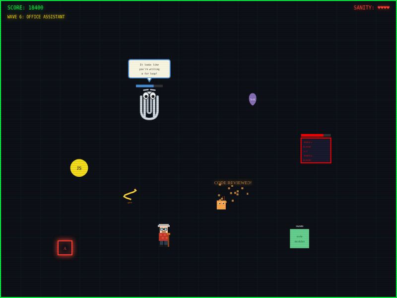

# get-off-my-stack
A retro arcade browser game where a grumpy old-school programmer smacks bad code with a cane. Fight bloated JS bundles, if/else centipedes, node_modules, memory leaks, Dan’s fixes, and the dreaded SAP 1000-line IF/ELSE boss. Built in one evening as a joke. No npm packages were harmed.


# 🧓 GET OFF MY STACK!

*A retro arcade browser game about code quality, built by someone who programmed in x86 assembly and has OPINIONS about your JavaScript.*



## 🎮 Play Now

**[👉 Play GET OFF MY STACK!](https://paperhurts.github.io/get-off-my-stack/)**

## About

You are a grumpy old-school programmer armed with nothing but a cane and decades of accumulated rage about modern software development. Bad code is flooding toward production and only you can stop it.

Smack bloated JavaScript bundles. Whack if/else centipedes. Obliterate node_modules before they consume all available disk space. And whatever you do, don't let Dan's fixes reach the codebase.

## Controls

| Input | Action |
|-------|--------|
| Arrow Keys / WASD | Move |
| Space | Swing Cane |
| Virtual Joystick (mobile) | Move |
| SMACK! Button (mobile) | Swing Cane |

## Enemies

| Enemy | Description | Threat Level |
|-------|-------------|:---:|
| **Bloated JS Bundle** | It was 2KB once. Then someone added lodash. | ⚠️ |
| **If/Else Centipede** | 4 segments. Each one is another condition that should have been a switch case. | ⚠️⚠️ |
| **node_modules** | It grows. It never stops growing. It consumes. | ⚠️⚠️⚠️ |
| **Memory Leak** | Fast, translucent, and nobody notices until prod is down. | ⚠️⚠️ |
| **Uncompressed 4K Texture** | 200MB of rainbow pixels that could have been a JPEG. | ⚠️⚠️⚠️⚠️ |
| **Dan's Fix** | He removed the square brackets and called it a day. | ⚠️⚠️⚠️ |
| **Spaghetti Code** | `goto` considered harmful since 1968. Still here. | ⚠️⚠️ |
| **SAP 1000-line IF/ELSE** | A boss. A thousand lines of conditional logic that should have been a lookup table. | 💀 |
| **Clippy** | A boss. It looks like you're writing a for loop. It would like to help. It will not stop helping — every few seconds it interrupts with a suggestion and summons two of Dan's fixes to assist you. Freeze it with the LINTER before it gets a word in. | 💀 |

Bosses don't go down easy: walking into one costs you a heart and shoves it back, but it keeps coming. Only the cane actually kills. Just one boss is on the field at a time.

## Power-Ups

| Power-Up | Effect |
|----------|--------|
| **ASM MANUAL** | x86 RAGE MODE — double damage, double speed |
| **LINTER** | Freezes all enemies |
| **gcc -O3** | Shrinks all enemies |
| **CODE REVIEW** | Instant kill — all enemies rejected |

## Waves

1. **Junior Devs** — JS blobs and Dan's fixes
2. **Framework Hell** — node_modules enter the chat
3. **Legacy Code** — if/else chains and memory leaks
4. **AAA Bloatware** — uncompressed textures join the party
5. **SAP Nightmare** — the first boss appears
6. **Office Assistant** — Clippy would like to help
7. **Production Deploy** — everything, everywhere, all at once

## Tech Stack

One HTML file. No build step. No npm install. No webpack. No transpilation. No framework. Just HTML, CSS, and vanilla JavaScript, the way God and Brendan Eich intended.

The irony of building a game about code bloat as a single file with zero dependencies is not lost on us.

## Tests

Also no dependencies. Node 18+:

```bash
node test_game.mjs    # behavioural — loads the real game code from index.html
node test_fixes.mjs   # static assertions against the source
```

`test_game.mjs` runs the actual `<script>` block from `index.html` against a
minimal fake DOM (`test_harness.mjs`), so the tests exercise the shipped code
rather than a copy of it.

There's also `test_fixes.html` for running the older checks in a browser. It
fetches `index.html`, so serve it rather than opening it from `file://`:

```bash
npx http-server -p 8099   # then open http://127.0.0.1:8099/test_fixes.html
```

## Mimic Metrics

This game was inspired by a real conversation about:
- Why games take up 200GB now when we used to fit them in kilobytes
- x86 assembly and the lost art of writing lean code  
- A developer named Dan who removed square brackets to fix a compiler error
- 1000-line IF/ELSE statements found in the wild in SAP
- The statistical significance of deploying 25 mimics in a D&D dungeon

## License

MIT — do whatever you want with it, just like Dan does with the codebase.

## Credits

Built on a vacation day while eating roast beef and avoiding thinking about work. 

No node_modules were installed in the making of this game.